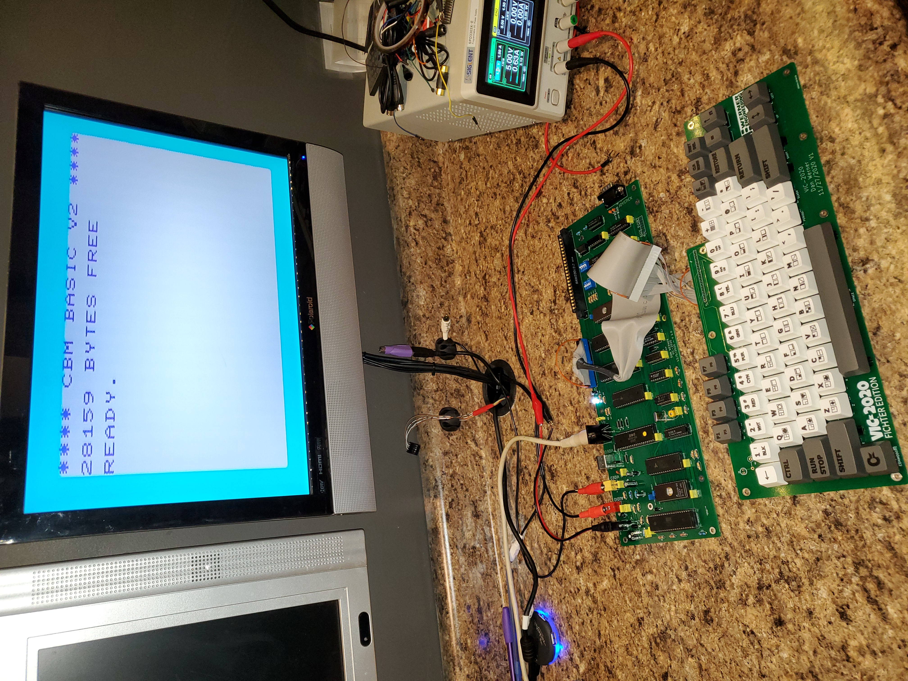
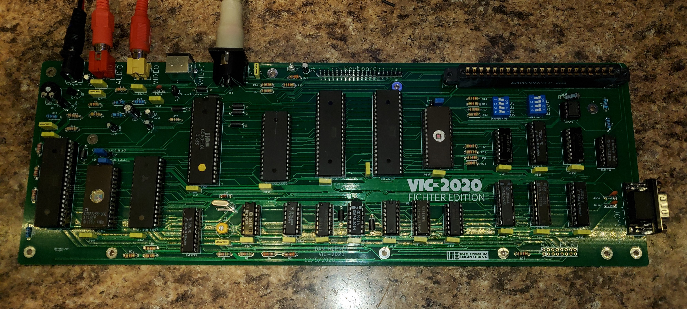
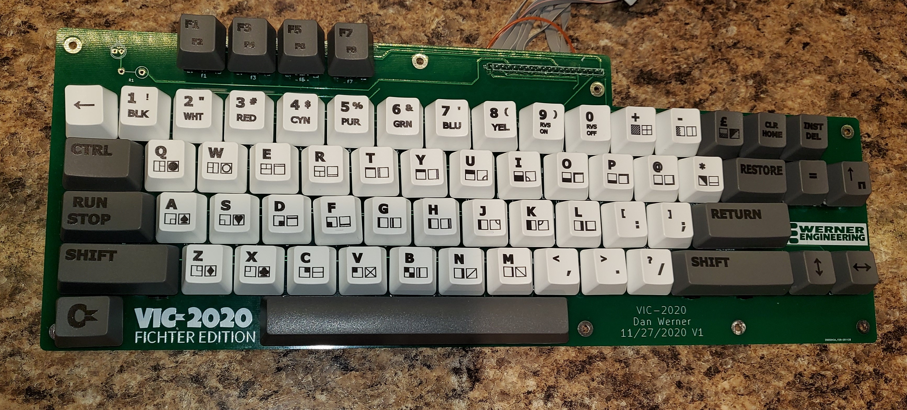
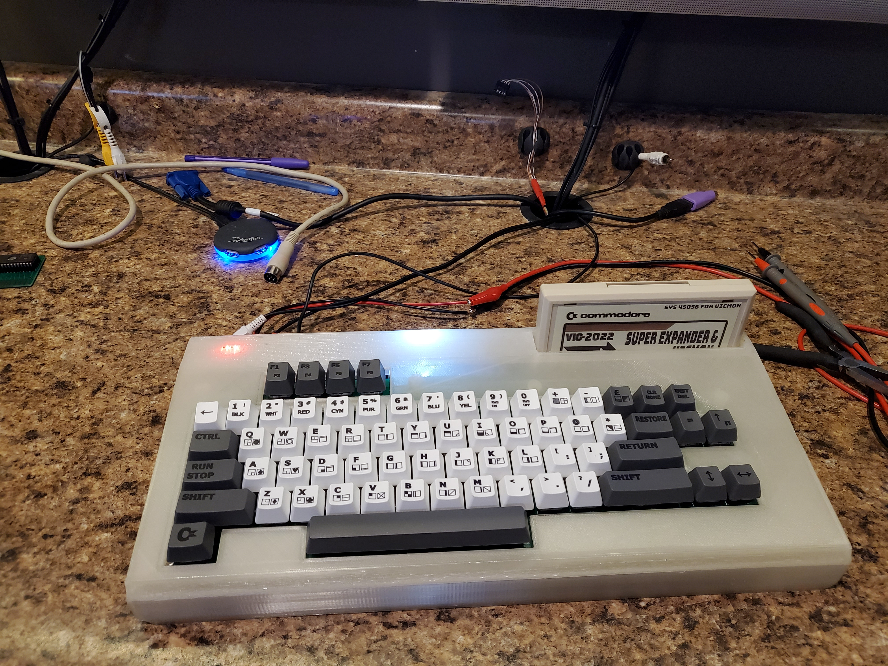
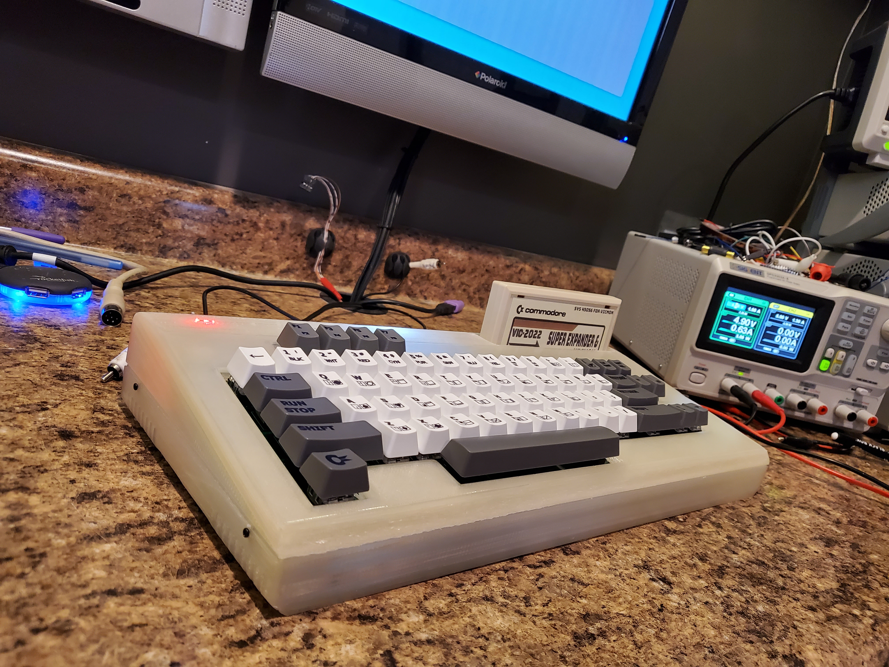
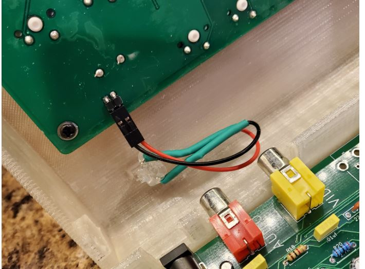
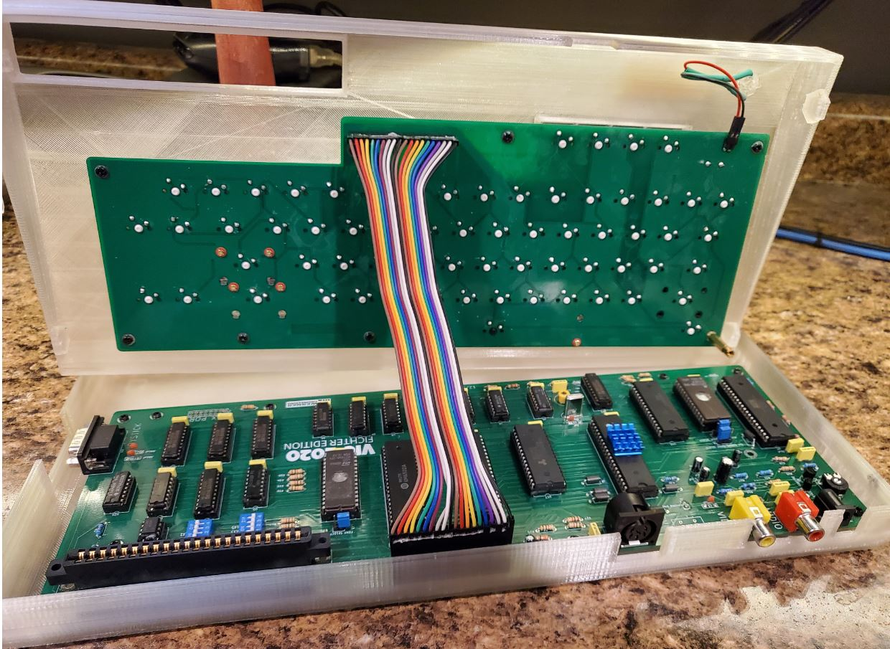

# Vic-2020
A Vic-20 clone created with [almost] all readily available parts

## Introduction
This project is an implementation of a VIC-20 (mostly) compatible computer. The project is built using a combination of 1980's era components (7400-series logic) and more modern components- such as a modern 6502 variant and 512 KiB SRAM and 512 KiB Flash ROMs. The only hard to find component is the MOS 6560 VIC video chip -- and it is my hope to follow up this project with a project to replace that chip with a FPGA replacement, providing the open source community a full path to re-creating the VIC-20 with all new components.

## Why?
Why would I do a replica of the VIC-20?   Well, like many others the VIC-20 was my first computer.  In 1981 I spent most of my (non-school) waking hours learning everything possible about this machine, and that launched me into a successful career in IT.   In the early 2000s I discovered the retro-computer scene and have spent many hours building and creating new retro computer designs following the work happening in such places as 6502.org and retrobrewcomputers.org.  So much so, that my boss has taken to giving me crap about spending my free time "Building VIC-20s" . . . .   It was earlier in 2020 when he had made one such comment that I realized that while I had constructed many vintage designs, I had never actually built a VIC-20.  I decided that I should correct that oversight as soon as possible -- and thus the VIC-2020 Fichter Edition (named after my boss) was born.

---

## What is included in this repo?
As of this time, the repo includes

1. The VIC-2020 Mainboard PCB Kicad design and Gerber files
2. The VIC-2020 Keyboard PCB Kicad design and Gerber files
3. OpenSCAD and STL files for a 3d printed case
4. Design Files for Max Keyboard Custom Printed Keycaps

---

## Known Bugs

* While the mainboard does have a S-VIDEO mod applied that should (in theory) provide S-VIDEO output, it does not work.   If anyone corrects this, please feel free to reach out and I will correct the schematics -- but for now, I would not populate the S-VIDEO connector, and always short the Chroma Disconnect jumper.
#### UPDATE
 Turns out the footprint for the SVIDEO connector in KiCad has the pins numbered incorrectly and that is the cause of the SVIDEO issue.   I have updated the PCB and Schematic to account for this, but have not tested the fix myself.  I am told that the SVIDEO out does work with a properly wired cable.

 note that the 1.1 version of the PCB still have the Chroma/Luma pins reversed on the video connector.  Seems that I made a patch to correct the pins and KiCAD also made a patch to correct the PCB layout of the connector, and thus reversed each other's work. . .  1.2 should be correct, but as always until it is tested, assume it needs patched.

---

## How is the VIC-2020 the same as a VIC-20?

The VIC-2020 should be mostly software compatible with the expanded and unexpanded Commodore VIC-20.   I have tested a variety of cartridges (commodore and third party) and have ran several homebrew and commercial disk based programs on the system with no issues.   Note that this does use a more modern variant of the 6502, so software relying on 6502 undocumented opcodes or bugs will not work properly.  The VIC-2020 has a commodore compatible IEC port that has been tested with a real 1571 and real 1541 and seems to work properly with one exception -- if the device holds the RESET line low the system will not function.   This can be observed if the VIC-2020 is connected to a powered off IED device -- the VIC will not function until the IEC device is powered on or unplugged from the VIC.

---

## How is the VIC-2020 different from a VIC-20?

Because the VIC-2020 is using more modern parts, it has ALOT of ram compared to the VIC-20.   The original VIC-20 shipped with 4k of ram . . .  the VIC-2020 has 256k.  This has some implications.   First, for compatibility there is a portion of the RAM that is just wasted. Of the 128k chip that is used for main memory, only 32k is accessible, the rest is hidden.  This is a design trade off that made the system less complex and ensured compatibility.   That said, small design changes were made to allow the 128k color ram to be totally usable by the system.  The first modification allowed all 8 bits of color ram to be used as storage for the system.  In the original VIC-20, color ram was only 4 bits wide, as the VIC chip only needs 4 bits to store color information.  In the VIC-2020 design all 8 bits are available to the CPU, even though only 4 bits are used by the VIC chip.  This should allow a programmer to store user information in the upper 4 bits of the color ram without affecting any other part of the system.   Also, the 6522 IO port that was dedicated to the user port on the VIC-20 has been repurposed as a "Page Register" (located at 0x9110 or 37136) on the VIC-2020 allowing 128 pages of color ram to be available for the VIC chip.  This should give the ability for some very interesting color effects to be produced on the VIC-2020, while still keeping the VIC mostly compatible.  This technique was demonstrated as early as 2010 in the sleepingelephant.com forums [here](http://sleepingelephant.com/ipw-web/bulletin/bb/viewtopic.php?t=4882).

### Power
Unlike the original, the VIC-2020 will run off of one regulated 5V 1.5A power supply.

### Ports
In order to simplify the VIC-2020s power requirements, the cassette and user ports were ommitted from the system.   It is possible to use the lines in the AUX connector (J11) and the IEC port to gain access to the cassette data lines if one wanted to use a cassette emulator.  The cartridge port is mostly compatible (assuming proper setting of SW3) with the omission of the RAM1,RAM2, & RAM3 lines.
Note that trimmer RV1 can be used to adjust video signal output strength.  If your particular TV appears either overdriven or too dim, adjust RV1 accordingly.   Variable Cap C2 can be used to adjust video signal phase -- adjust this trimmer if your VIC shows no color or the wrong colors.

### Ram Configuration
For simplicity sake, the VIC-2020 in even its lowest memory configuration has the VIC 3K memory expansion enabled at RAM1, RAM2, and RAM3, giving it 8K of base ram, 6.5k free for BASIC.   This configuration is totally compatible with most "unexpanded" VIC software, but is incompatible with any cartridge that includes the 3k RAM expansion option (such as the VIC Super Expander Cartridge).  The other RAM configuration options for BLK1, BLK2, BLK3, and BLK5 are DIP switch selectable allowing memory to be configured.   It is best to have each RAM block only assigned to either the Expansion Port (SW3) or the Internal RAM (SW1) but not both at the same time.  When in doubt set all of SW3 to "on" and all of SW1 to "off" and you should have a mostly compatible unexpanded VIC.  For a mostly compatible expanded VIC set BLK1,BLK2, BLK3 on SW1 to "on" and SW3 to "off".

### Character ROM Configuration
The 8K 2764 EPROM at U19 contains the character ROM image for the VIC-2020.  The VIC chip only needs 4K to store a complete set of character images, so jumper J3 is used to select one of two character sets that can be stored on the 2764.  If pins 1&2 are shorted on the jumper the first 4K of the chip is used (addresses 0x0000-0x0FFF) for the character patterns and if pins 2&3 are shorted the second 4K (addresses 0x1000-0x1FFF) are used.

### System ROM Configuration
On the VIC-2020 it is possible to use several different types of main ROM chips and have several ROM images burned at the same time -- all selected by jumpers J1 and J2.

Jumper Settings|Chip Used|Resulting eprom configuration
---------------|---------|-----------------------
J1 1&2, J2 1&2|27512         | BASIC image at 0x0000 through 0x1FFF KERNAL at 0x2000 through 0x3FFF
J1 1&2, J2 1&2|27256         | BASIC image at 0x0000 through 0x1FFF KERNAL at 0x2000 through 0x3FFF
J1 1&2, J2 1&2|27128         | BASIC image at 0x0000 through 0x1FFF KERNAL at 0x2000 through 0x3FFF
J1 1&2, J2 2&3|27512         | BASIC image at 0x4000 through 0x5FFF KERNAL at 0x6000 through 0x7FFF
J1 1&2, J2 2&3|27256         | BASIC image at 0x4000 through 0x5FFF KERNAL at 0x6000 through 0x7FFF
J1 1&2, J2 2&3|27128         | NOT VALID
J1 2&3, J2 1&2|27512         | BASIC image at 0x8000 through 0x9FFF KERNAL at 0xA000 through 0xBFFF
J1 2&3, J2 1&2|27256         | NOT VALID
J1 2&3, J2 1&2|27128         | NOT VALID
J1 2&3, J2 1&2|27512         | BASIC image at 0xC000 through 0xDFFF KERNAL at 0xE000 through 0xFFFF
J1 2&3, J2 1&2|27256         | NOT VALID
J1 2&3, J2 1&2|27128         | NOT VALID

---

## Bill Of Materials

### Mainboard

Part Number|Quantity|Name
-----------|--------|----
C35,C36	|2|	.001uf Capacitor
C7,C12-C34|	23|	.01uf Capacitor
C1,C6,C8,C10,C40|	5|	.1uf Capacitor
C37	|1|	.47uF Electrolytic Capacitor
C38	|1|	10uF Electrolytic Capacitor
C4	|1|	10uf Capacitor
C11	|1|	1uf Electrolytic Capacitor
C9	|1|	2.2uF Electrolytic Capacitor
C5	|1|	220pf Capacitor
C3	|1|	2pf Capacitor
C39	|1|	47uF Capacitor
C2	|1|	8-90pf  Variable Capacitor
FB1-FB9|	9|	Ferrite_Bead_Small
J1,J2,J3|	3|	Pin Header 1x03 2.54mm
J10	|1|	Barrel Jack
J11	|1|	Pin Header 2x8 2.54mm
J12	|1|	Card Edge Connector 2x22 (Mouser #:587-305-044-520-502)
J13	|1|	DIN 6 IEC connector (mouser#571-9-211509)
J14	|1|	DSUB 9 Male
J4,J9	|2|	Pin Header 1x2 2.54mm
J5	|1|	DIN-4 (mouser#571-5749181-1)
J6,J7	|2|	RCA Jack
J8	|1|	Pin Header 1x20
Q1	|1|	2sc1959
Q2	|1|	2SC1815
R36	|1|	75ohm Resistor 1/4w
R15	|1|	180ohm Resistor 1/4w
R16	|1|	240ohm Resistor 1/4w
R22	|1|	270ohm Resistor 1/4w
R2,R4,R24	|3|	330ohm Resistor 1/4w
R21	|1|	470ohm Resistor 1/4w
R17	|1|	510ohm Resistor 1/4w
R3,R5	|2|	560ohm Resistor 1/4w
R19	|1|	1.8Kohm Resistor 1/4w
R23	|1|	10Kohm Resistor 1/4w
R6	|1|	150Kohm Resistor 1/4w
R7,R11-R14,R18,R25-R35	|16|	1K ohm Resistor 1/4w
R8-R10	|3|	2.2Kohm Resistor 1/4w
R20	|1|	2.7Kohm Resistor 1/4w
R1	|1|	220kohm Resistor 1/4w
RV1	|1|	1Kohm Variable Resistor (Mouser# 531-PT10LV112A22PMS)
SW1,SW3	|2|	DIP Switch 4 pos
U19	|1|	2764
U20	|1|	6560 (MOS, VIC-20 pull or E-Bay)
U1	|1|	7402
U4	|1|	7406
U13	|1|	27512
U24	|1|	74ALS32
U8	|1|	74LS00
U11	|1|	74LS02
U9	|1|	74LS04
U5,U10	|2|	74LS133
U2,U6	|2|	74LS138
U14,U15,U16,U18,U23	|5|	74LS245
U12,U17	|2|	AS6C1008-55PCN
U3	|1|	LM555
U7	|1|	W65C02SxP
U21,U22	|2|	W65C22NxP
Y1	|1|	Crystal 14.31818Mhz

### Keyboard

Quantity|Name
--------|----
65|Cherry MX Switch | (Example Mouser 540-MX1A-11NW)
4|Switch Leveling Kit| Mouser 540-G99-0226 Note: Use one of 540-G99-0742 to build a through hole leveling kit for the spacebar
1|Pin Header 1x20
1|Pin Header 1x2 or LED
1|330 Ohm Resistor
1| Keycap set (See Max Keyboard Template to order custom keycaps)
1| 1x20 Female to Female dupont connector ribbon cable to connect keyboard to mainboard

### Case

The case for the Vic-2020 was created using openSCAD and was printed on the AnyCubic Chiron large format printer.   The OpenSCAD source files and the STL files are included in the archive.  The case is designed to allow you to install a power led in the upper left corner.   The opening is intended for two rectangular LEDs glued as shown here:

It is also necessary to install a stabilizer on one corner of the keyboard to ensure that the keyboard PCB does not flex while typing.  This is how I did it:

When complete, the interior of the 3d printed case will look like this:

### Builder Comments

Below is a couple of observations from builders that might be useful in your build.  I have not tested any of these suggestions, just passing on collective wisdom :)

* One bulder commented that he needed to replace U9 (74LS04->74F04) and U11 (74LS02->74F02) with F series logic in order to get clean RAM access.   I have not had a need to do this on any of my builds, but timing is very tight on this board, and it is always possible that these substitutions would help clear up issues.  This same builder needed to use a Rockwell 65C02 in place of the WDC 65C02 to get a stable build.

* Another builder noted that is is important to use a 2764 EPROM for the character ROM.   A 27C64 EPROM caused graphical glitching when used.

* It was recently reported that at least one builder has had success using a 6561 PAL VIC chip to replace the 6560 NTSC VIC chip.  It is also necessary to replce the 14.31818Mhz crystal with a 4.433618 MHz crystal in a PAL system.

### Questions?

If there are any questions, I can be reached at vic2020Dan at gmail dot com.

---